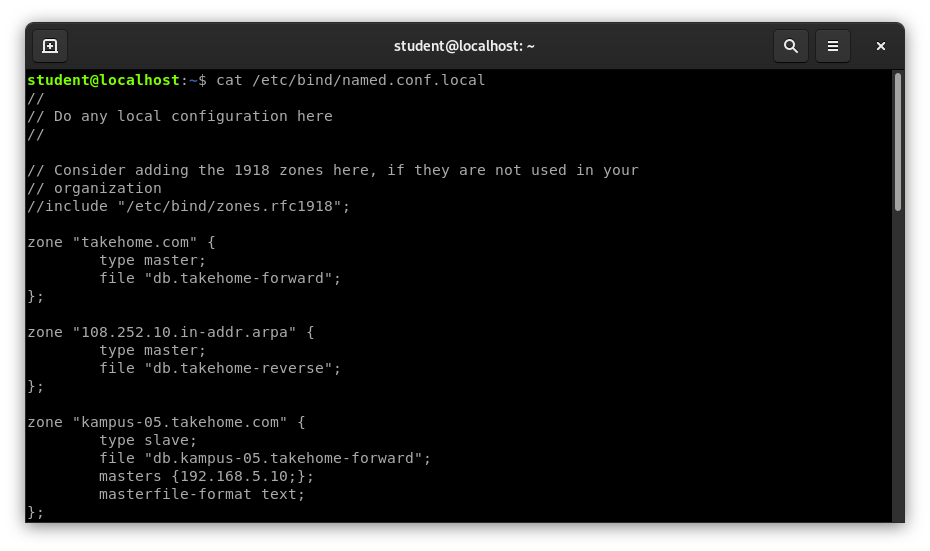

# Konfigurasi DNS Master Slave

Tahap pertama adalah melakukan instalasi dan konfigurasi pada server dns master.

Apabila server dns sudah dikonfigurasi maka selanjutnya kita edit file `named.conf.local` dengan command berikut.

```console
cat /etc/bind/named.conf.local
```

Edit named.conf.local seperti dibawah ini.



Selanjutnya adalah mengedit konfigurasi file forward.

```console
cat /var/cache/bind/db.kampus-05.takehome.forward
```

Ubah seperti dibawah ini.


Pada file konfigurasi di atas, kita menambahkan subdomain ns2 untuk server dns slave. Subdomain tersebut dipetakan ke ip address 10.252.108.10

Kemudian edit juga pada file reverse-nya dengan command berikut.

```console
cat /var/cache/bind/db.kampus-05.takehome.reverse
```

Simpan file konfigurasi, lalu restart service dns.

```console
systemctl restart bind9
```

atau

```console
service bind9 restart
```

Terkahir, edit file /etc/resolv.conf lalu tambahkan ip address server dns slave.

```console
nano /etc.resolv.conf
```

tambahkan ip address server dns slave

```console

nameserver 10.252.108.10
```

# Konfigurasi DNS Slave

Konfigurasi yang dilakukan pada dns slave adalah mendefinisikan zona seperti pada server dns master. Akan tetapi sebelum melakukan konfigurasi, instal dahulu service dns servernya.

```console
apt install bind9
```

Selanjutnya edit file named.conf.local.

```console
nano /etc/bind/named.conf.local
```

Tambahkan konfigurasi berikut :

```console
zone "kampus-05.takehome.com" {
    type slave;
    file "kampus-05.takehome.com.forward";
    masters {10.252.108.10;};
    };
```

Konfigurasi di atas adalah mendefinisikan zona `kampus-05.takehome.com`. Karena ini adalah DNS slave, maka type yang digunakan adalah slave. Kemudian kita tambahkan DNS masternya pada bagian,
masters {10.252.108.10;};

Pada konfigurasi di atas, kita hanya mendefinisikan forward zone, sedangkan reverse zone-nya tidak ada. Hal ini dikarenakan DNS slave tidak melakukan backup atau caching terhadap file reverse. Sehingga nanti hanya akan ada file forward saja yang akan diterima dari DNS master.

Kita juga tidak mendefinisikan direktori tempat menyimpan file forward-nya. Secara default, direktori yang akan digunakan untuk menyimpan file tersebut adalah `/var/cache/bind`.

Langkah berikutnya adalah mengedit file `/etc/resolv.conf`lalu menambahkan ip DNS master dan DNS slave.

```console
nameserver 10.252.108.10
nameserver 192.168.5.80
```

Kemudian merestart service dns.

```console
systemctl restart bind9
```

atau

```console
service bind9 restart
```

## Verifikasi

Cek pada direktori `/var/cache/bind` apakah sudah ada file forward dari DNS master dengan command berikut.

```console
ls /var/cache/bind/
```

Maka akan muncul seperti ini

```console
db.10 kampus-05.takehome.com.forward managed-keys.bind
```

Selanjutnya kita coba melakukan nslookup dari dns slave dengan command berikut.

```console
nslookup ns2.kampus-05.takehome.com
```

jika hasilnya muncul maka selesai sudah konfigurasi DNS Master Slave kita.
