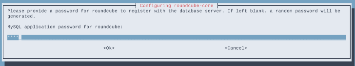
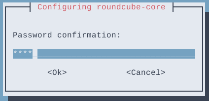
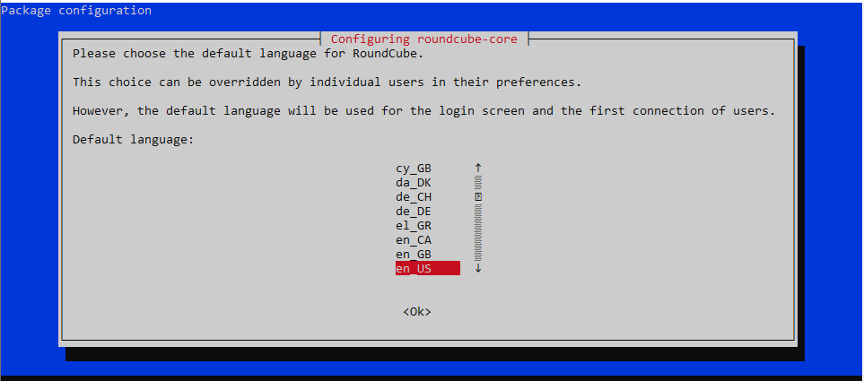
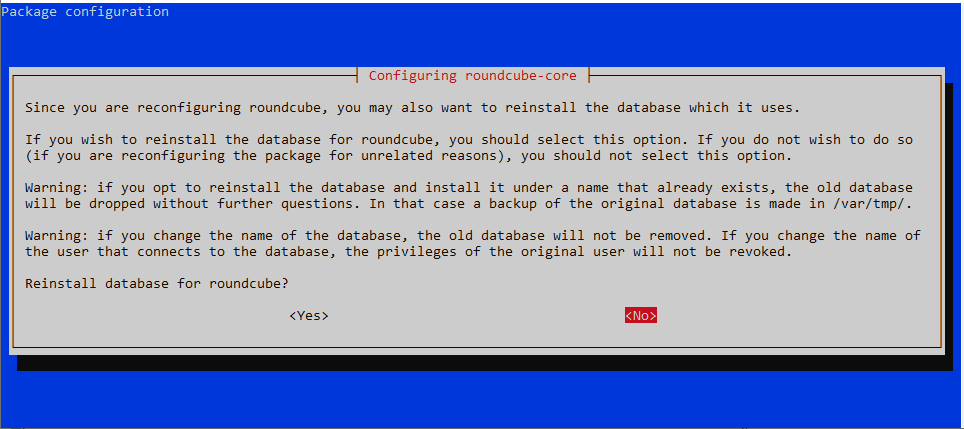
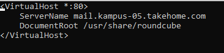
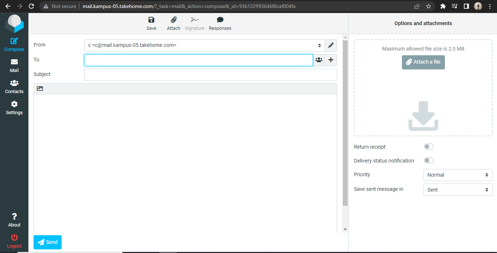
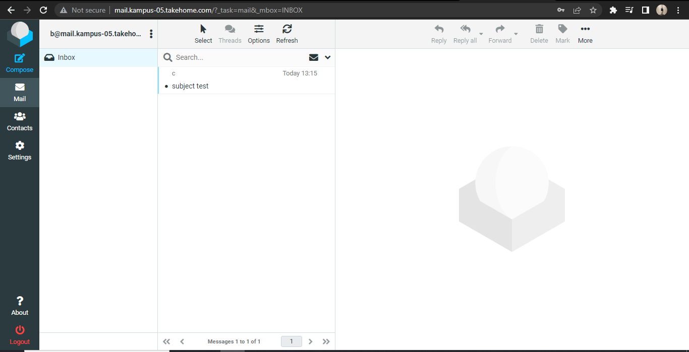

# Mail Server

### Daftar isi

- [Mail Server](#mail-server)
  - [Daftar isi](#daftar-isi)
- [Instalasi Postfix](#instalasi-postfix)
  - [Persiapan](#persiapan)
  - [Konfigurasi](#konfigurasi)

# Instalasi Postfix

## Persiapan

Untuk menginstall postfix, yang pertama kali harus disiapkan adalah webserver (apache). Setelah webserver terinstall, masukkan perintah dibawah untuk menginstall postfix kemudian Enter dan akan tampil beberapa tampilan untuk mengatur konfigurasi dari postfix

```console
sudo apt install postfix
```

## Konfigurasi

Ditengah proses instalasi nantinya akan muncul beberapa tampilan untuk konfigurasi, konfigurasi yang digunakan kelompok kami (kelompok 05) adalah sebagai berikut:


Konfigurasi diatas nantinya akan disimpan pada file `main.cf` pada folder `/etc/postfix` (nantinya kita akan banyak mengubah konfigurasi pada file ini). Penjelasan dan gambaran file `main.cf` setelah konfigurasi adalah seperti dibawah

- `mydestination` : daftar tujuan pengiriman email yang di-handle oleh server postfix ini. Dalam kasus ini, ada beberapa domain yang terdaftar, termasuk `debian`, `kampus-05.takehome.com`, dan `localhost.localdomain`.
- `relayhost` : opsi ini digunakan untuk mengatur relay host yang digunakan untuk meneruskan email ke tujuan akhir. Dalam kasus ini, nilai relayhost kosong, yang berarti postfix akan mengirim email langsung ke tujuan akhir.
- `mynetworks` : daftar jaringan yang diizinkan untuk mengirim email melalui server postfix ini. Dalam hal ini, beberapa jaringan IP yang diizinkan termasuk `127.0.0.0/8`, `[::ffff:127.0.0.0]/104`, `[::1]/128`, dan `0.0.0.0/0`.
- `mailbox_size_limit` : batasan ukuran kotak surat untuk pengguna. Dalam hal ini, nilai 0 menunjukkan bahwa tidak ada batasan ukuran.
- `recipient_delimiter` : opsi ini digunakan untuk mengatur karakter yang digunakan sebagai delimiter pada alamat email. Dalam kasus ini, karakter `+` digunakan sebagai delimiter.
- `inet_interfaces` : daftar antarmuka jaringan yang digunakan oleh postfix untuk menerima koneksi. Dalam hal ini, semua antarmuka jaringan diaktifkan.
- `inet_protocols` : daftar protokol jaringan yang digunakan oleh postfix untuk menerima koneksi. Dalam hal ini, semua protokol diaktifkan.

Dan penampakan isi lengkap seperti di bawah ini:

```console
# See /usr/share/postfix/main.cf.dist for a commented, more complete version


# Debian specific:  Specifying a file name will cause the first
# line of that file to be used as the name.  The Debian default
# is /etc/mailname.
#myorigin = /etc/mailname

smtpd_banner = $myhostname ESMTP $mail_name (Debian/GNU)
biff = no

# appending .domain is the MUA's job.
append_dot_mydomain = no

# Uncomment the next line to generate "delayed mail" warnings
#delay_warning_time = 4h

readme_directory = no

# See http://www.postfix.org/COMPATIBILITY_README.html -- default to 2 on
# fresh installs.
compatibility_level = 2

# TLS parameters
smtpd_tls_cert_file=/etc/ssl/certs/ssl-cert-snakeoil.pem
smtpd_tls_key_file=/etc/ssl/private/ssl-cert-snakeoil.key
smtpd_tls_security_level=may

smtp_tls_CApath=/etc/ssl/certs
smtp_tls_security_level=may
smtp_tls_session_cache_database = btree:${data_directory}/smtp_scache

smtpd_relay_restrictions = permit_mynetworks permit_sasl_authenticated defer_unauth_destination
myhostname = debian
alias_maps = hash:/etc/aliases
alias_database = hash:/etc/aliases
myorigin = /etc/mailname
mydestination = debian, kampus-05.takehome.com, debian, localhost.localdomain, localhost, mail.kampus-05.takehome.com
relayhost =
mynetworks = 127.0.0.0/8 [::ffff:127.0.0.0]/104 [::1]/128 0.0.0.0/0
mailbox_size_limit = 0
recipient_delimiter = +
inet_interfaces = all
inet_protocols = all
```

Untuk pengetesan, masukkan perintah `telnet mail.kampus-05.takehome.com` pada device client atau bisa menggunakan perintah `netstat -lntp | grep :25` pada server


[def]: #daftar-isi

# Konfigurasi Dovecot

Edit file konfigurasi /etc/dovecot/dovecot.conf.

```console
sudo nano /etc/dovecot/dovecot.conf
```

Uncomment dan edit baris berikut.


Edit file konfigurasi /etc/dovecot/conf.d/10-auth.conf.

```console
sudo nano /etc/dovecot/conf.d/10-auth.conf
```

Uncomment dan ganti dari yes ke no.

```console
# connection is considered secure and plaintext authentication is allowed.
# See also ssl=required setting.
disable_plaintext_auth = no
```

Edit file konfigurasi /etc/dovecot/conf.d/10-mail.conf.

```console
sudo nano /etc/dovecot/conf.d/10-mail.conf
```

Uncomment pada `mail_location = maildir:~/Maildir` dan beri comment pada `mail_location = mbox:~/mail:INBOX=/var/mail/%u`.


Restart dovecot service.

```console
sudo systemctl restart dovecot
```

# Menambahkan User Email

Tambahkan beberapa user dan password menggunakan perintah adduser yang akan digunakan untuk user email. Pada percobaan kali ini akan membuat dua user, yaitu user `b` dan user `c`. dengan perintah di bawah.

```console
sudo adduser b
```

```console
sudo adduser c
```

Restart postfix dan dovecot service.

```console
sudo systemctl restart postfix dovecot
```

# Testing Postfix dan Dovecot menggunakan Telnet

Install package telnet.

```console
sudo apt install telnet
```

Test kirim file menggunakan perintah telnet `<nama domain> <port>` dengan menggunakan port 25 (SMTP). Masukkan nama alamat pengirim menggunakan `mail from:`. Masukkan nama alamat penerima menggunakan `rcpt to:`. Ketikkan data lalu enter. Isikan subject dengan megetikkan `Subject: <isi subject>`. Lalu isikan pesan yang akan dikirim kemudian isikan titik (.) untuk mengakhiri pesan.

Gunakan perintah ini untuk mengirim test email.

```console
telnet mail.kampus-05.takehome.com 25
```


Melihat pesan menggunakan perintah `telnet <nama domain> <port>`. Login user menggunakan `user <nama user>`. Dan masukkan password menggunakan `pass <password>`. Untuk melihat list pesan yang diterima menggunakan perintah `list`. Dan untuk membuka pesan yang diterima menggunakan perintah `retr <nomer pesan>`. Perintah `quit` untuk keluar dari telnet.

```console
telnet mail.kampus-05.takehome.com 110
```


# Konfigurasi Roundcube

## Install Mariadb dan Roundcube

Install roundcube sebagai webmail yang akan digunakan oleh client, dan package mariadb yang nantinya akan digunakan sebagai database dari roundcube.

```console
sudo apt install mariadb-server roundcube
```

Pilih `yes` untuk membuat database secara otomatis oleh roundcube


Masukkan password database roundcube.





Edit file `/etc/roundcube/config.inc.php`.

```console
sudo nano /etc/roundcube/config.inc.php
```

Isikan default host dengan nama domain mail server.

```console
// For example %n = mail.domain.tld, %t = domain.tld
$config['default_host'] = 'mail.kampus-05.takehome.com';
```

Ganti smtp server dengan nama domain mail server.

```console
// For example %n = mail.domain.tld, %t = domain.tld
$config['smtp_server'] = 'mail.kampus-05.takehome.com';
```

Ganti smtp port dari 587 ke 25.

```console
// SMTP port. Use 25 for cleartext, 465 for Implicit TLS, or 587 for STARTTLS (default)
$config['smtp_port'] = 25;
```

Kosongkan value dari smtp user.

```console
// will use the current username for login
$config['smtp_user'] = '';
```

Kosongkan value dari smtp password.

```console
// will use the current user's password for login
$config['smtp_pass'] = '';
```

Configure ulang roundcube (langkah ini bisa dilewati).

```console
sudo dpkg-reconfigure roundcube-core
```

Kosongkan karena kita tidak menggunakan tls.


Pilih bahasa untuk roundcube.



Pilih no jika tidak ingin reinstall database yang telah dibuat.



Check pada pilihan apache dan uncheck lighttpd.


Pilih yes untuk merestart web server.


Edit apache config untuk memasukkan konfigurasi tambahan dari roundcube ke apache config.

```console
sudo nano /etc/apache2/apache2.conf
```

Tambahkan pada baris paling bawah.

```console
Include /etc/roundcube/apache.conf
```

Selanjutnya, masuk ke directory website apache dan tambahkan file baru untuk mail server.

```console
cd /etc/apache2/sites-available
sudo touch mail.conf
sudo nano mail.conf
```



Disable apache default config dan enable kan mail config.

```console
a2dissite 000-default.conf
a2ensite mail.conf
```

Restart apache service.

```console
systemctl restart apache2
```

# Testing

Selanjutnya buka web browser pada sisi client dan masukkan domain dari mail server, maka akan muncul interface dari roundcube. Lalu login menggunakan salah satu user yang telah dibuat.


Klik pada compose dan isikan pesan untuk user lainnya. Lalu klik send.



Logout dan login ke user penerima, maka akan muncul pesan yang dikirim.


