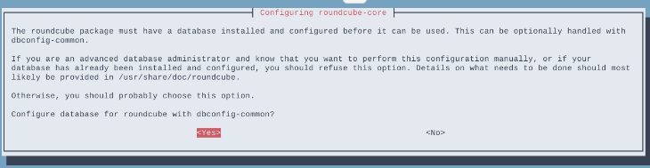
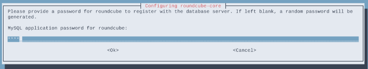
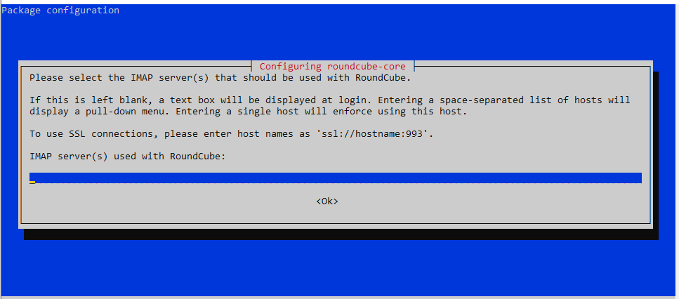
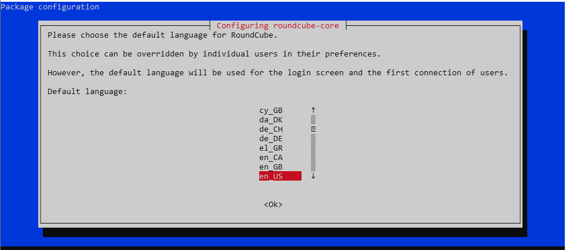
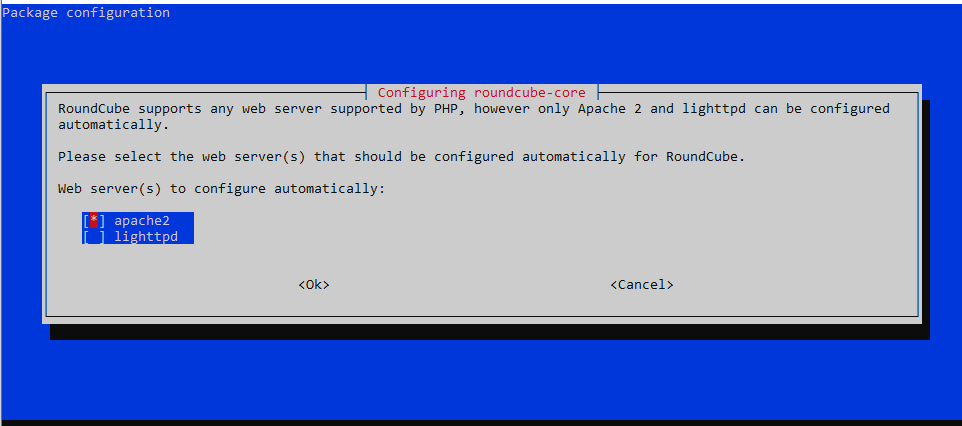
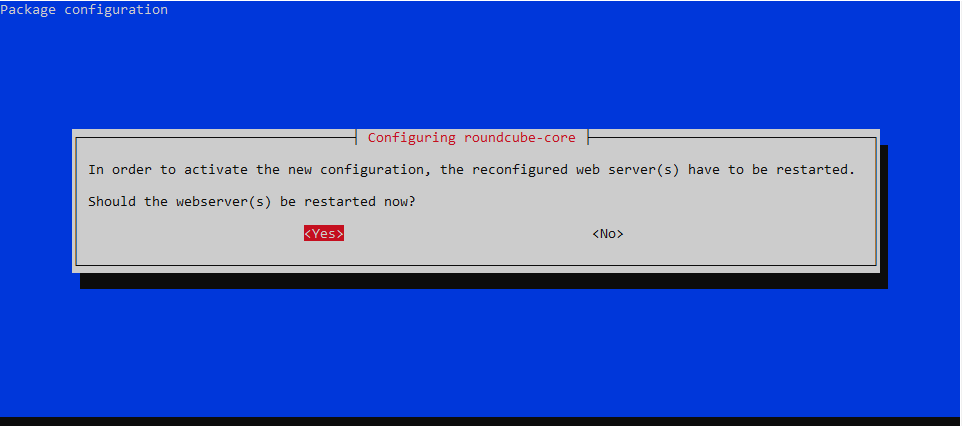
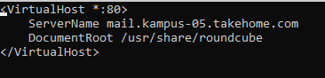
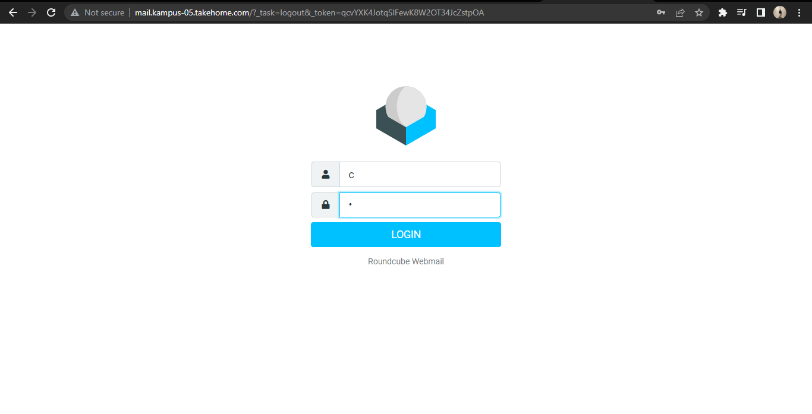
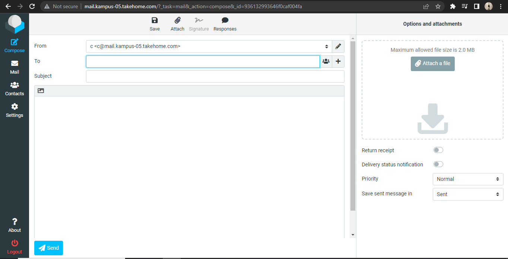
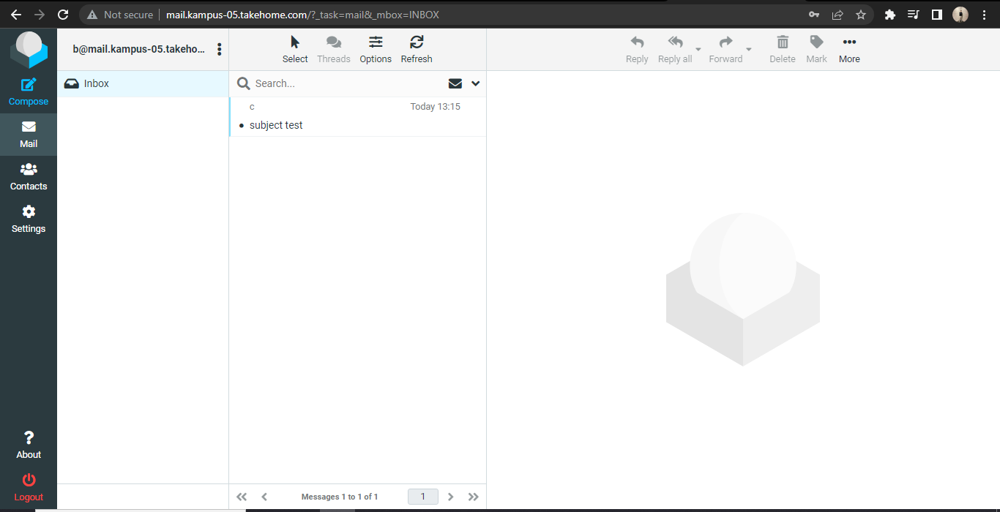

# Konfigurasi Roundcube

## Install Mariadb dan Roundcube

Install roundcube sebagai webmail yang akan digunakan oleh client, dan package mariadb yang nantinya akan digunakan sebagai database dari roundcube.

```console
sudo apt install mariadb-server roundcube
```

Pilih `yes` untuk membuat database secara otomatis oleh roundcube



Masukkan password database roundcube.




Edit file `/etc/roundcube/config.inc.php`.

```console
sudo vim /etc/roundcube/config.inc.php
```

Isikan default host dengan nama domain mail server.

```console
// For example %n = mail.domain.tld, %t = domain.tld
$config['default_host'] = 'mail.kampus-05.takehome.com';
```

Ganti smtp server dengan nama domain mail server.

```console
// For example %n = mail.domain.tld, %t = domain.tld
$config['smtp_server'] = 'mail.kampus-05.takehome.com';
```

Ganti smtp port dari 587 ke 25.

```console
// SMTP port. Use 25 for cleartext, 465 for Implicit TLS, or 587 for STARTTLS (default)
$config['smtp_port'] = 25;
```

Kosongkan value dari smtp user.

```console
// will use the current username for login
$config['smtp_user'] = '';
```

Kosongkan value dari smtp password.

```console
// will use the current user's password for login
$config['smtp_pass'] = '';
```

Configure ulang roundcube (langkah ini bisa dilewati).

```console
sudo dpkg-reconfigure roundcube-core
```

Kosongkan karena kita tidak menggunakan tls.



Pilih bahasa untuk roundcube.



Pilih no jika tidak ingin reinstall database yang telah dibuat.


Check pada pilihan apache dan uncheck lighttpd.



Pilih yes untuk merestart web server.



Edit apache config untuk memasukkan konfigurasi tambahan dari roundcube ke apache config.

```console
sudo nano /etc/apache2/apache2.conf
```

Tambahkan pada baris paling bawah.

```console
Include /etc/roundcube/apache.conf
```

Selanjutnya, masuk ke directory website apache dan tambahkan file baru untuk mail server.

```console
cd /etc/apache2/sites-available
sudo touch mail.conf
sudo nano mail.conf
```



Disable apache default config dan enable kan mail config.

```console
a2dissite 000-default.conf
a2ensite mail.conf
```

Restart apache service.

```console
systemctl restart apache2
```

# Testing

Selanjutnya buka web browser pada sisi client dan masukkan domain dari mail server, maka akan muncul interface dari roundcube. Lalu login menggunakan salah satu user yang telah dibuat.



Klik pada compose dan isikan pesan untuk user lainnya. Lalu klik send.



Logout dan login ke user penerima, maka akan muncul pesan yang dikirim.


