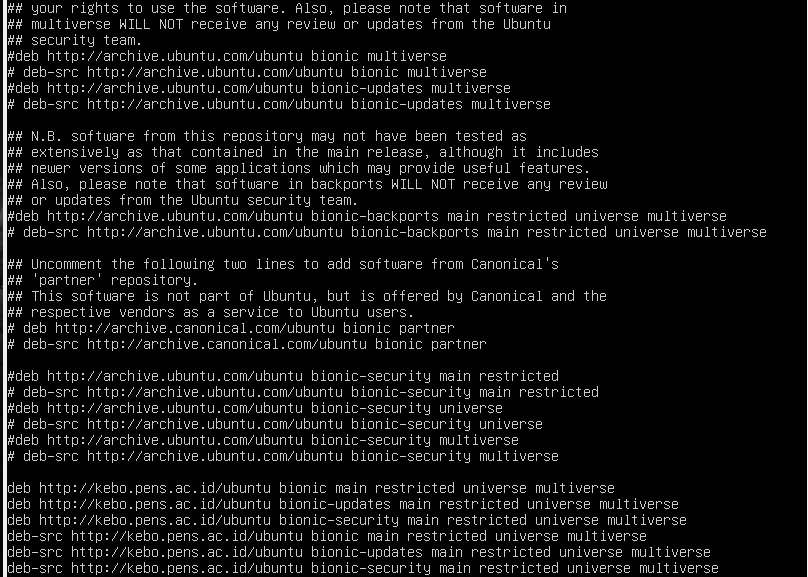

### Daftar isi

- [Identifikasi Kernel](#identifikasi-kernel)
- [Identifikasi Direktori Root Pada Linux](#identifikasi-direktori-root-pada-linux)
- [Perbedaan `sudo` dan `su`](#perbedaan-sudo-dan-su)
- [Repository](#repository)
- [Package manager](#package-manager)

<br/>

# Identifikasi Kernel

Kernel Linux adalah kernel yang digunakan dalam sistem operasi GNU/Linux. Kernel ini merupakan turunan dari keluarga sistem operasi Unix, dirilis dengan menggunakan lisensi GNU General Public License (GPL), dan dikembangkan oleh pemrogram di seluruh dunia.

Untuk menampilkan kernel yang digunakan pada distro, kita bisa menggunakan perintah `uname -a` pada terminal.


Diatas adalah contoh dari penggunaan perintah `uname -a` pada terminal dan kernel yang digunakan oleh OS akan ditampilkan.

<br/>

**penjelasan kernel** :

Pada gambar diatas, kernel yang digunakan adalah versi 4.15.0-204-generic.

- 4 adalah nomor utama kernel, yang menunjukkan bahwa ini adalah kernel seri 4.
- 15 adalah nomor minor kernel, yang menunjukkan bahwa ini adalah kernel seri 15 dari seri 4.
- 0 adalah nomor revisi kernel, yang menunjukkan bahwa ini adalah revisi pertama dari kernel seri 15.
- 204 adalah nomor pembangunan kernel, yang menunjukkan bahwa ini adalah build ke-204 dari revisi pertama dari kernel seri 0.
  <br/>

# Identifikasi Direktori Root Pada Linux


Pada linux, terdapat beberapa folder pada folder `/` atau `root`. Folder dan fungsi dari folder tersebut adalah:

1. `/bin` - aplikasi-aplikasi biner penting
2. `/boot` - file-file konfigurasi boot, kernel, dan file lain yang dibutuhkan ketika sistem booting
3. `/dev` - berisi file-file device (divais) seperti /dev/tty, /dev/input/mice
4. `/etc` - file konfigurasi, skrip startup, dll (etc)...
5. `/home` - direktori home bagi masing-masing user
6. `/initrd` - digunakan untuk mengkustomisasi initrd yang berjalan saat proses boot
7. `/lib` - pustaka-pustaka yang diperlukan oleh sistem
8. `/lost`+found - menyediakan sistem lost+found untuk file yang berada dibawah direktori root (/)
9. `/media` - partisi yang secara otomatis dimount di harddisk dan removable mediaseperti CD, kamera digital, dll.
10. `/mnt` - mounted filesistem secara manual di harddisk
11. `/opt` - menyediakan lokasi untuk aplikasi-aplikasi optional yang akan diinstal
12. `/proc` - direktori dinamis khusus yang menangani informasi mengenai kondisi sistem, termasuk proses-proses yang sedang berjalan
13. `/root` - direktori home bagi user root, diucapkan 'slash-root'. bedakan dengan /
14. `/sbin` - biner-biner sistem yang penting, biasanya aplikasi-aplikasi bagi admin
15. `/srv` - can contain files that are served to other systems
16. `/sys` - berkas sistem (system)
17. `/tmp` - berkas sementara (temporary)
18. `/usr` - aplikasi dan berkas yang tersedia untuk digunakan untuk pengguna (users)
19. `/var` - berkas variabel seperti log dan basis data

<br/>

# Perbedaan `sudo` dan `su`

`su` (atau "switch user") digunakan untuk mengubah identitas pengguna menjadi akun superuser atau akun lain, sementara `sudo` (atau "superuser do") digunakan untuk menjalankan perintah tertentu sebagai akun superuser atau akun lain tanpa perlu masuk ke dalam akun superuser secara langsung.

Saat menggunakan perintah `su`, pengguna harus memasukkan kata sandi untuk akun superuser atau akun lain yang dituju. Namun, saat menggunakan perintah `sudo`, pengguna diminta untuk memasukkan kata sandi mereka sendiri untuk memverifikasi identitas mereka sebelum menjalankan perintah.

Penggunaan `sudo` lebih aman daripada `su` karena tidak memerlukan pengguna untuk masuk ke dalam akun superuser secara langsung. Ini membatasi potensi kerusakan atau kesalahan yang dapat terjadi saat menggunakan akses superuser. sudo su untuk folder saat ini

```bash
# super user ke home user
sudo su

# ke root
sudo su -
```


<br/>

# Repository

Repositori Linux adalah lokasi penyimpanan tempat sistem Anda mengambil dan menginstal pembaruan dan aplikasi OS. Setiap repositori adalah kumpulan perangkat lunak yang di-host di server jauh dan dimaksudkan untuk digunakan untuk menginstal dan memperbarui paket perangkat lunak pada sistem Linux.

Untuk melihat repository mana saja yang digunakan pada sistem, kita bisa menggunakan perintah `cat /etc/apt/source.list`.



Ada beberapa jenis repository pada linux:

1. `deb cdrom` adalah repository dari CD/DVD instalasi Ubuntu.
2. `deb http://id.archive.ubuntu.com/ubuntu/ kinetic main restricted` adalah repository utama (main) Ubuntu, yang berisi paket-paket utama untuk sistem operasi Ubuntu.
3. `deb http://id.archive.ubuntu.com/ubuntu/ kinetic-updates main restricted` adalah repository Ubuntu untuk pembaruan (updates) dari paket-paket di repository utama.
4. `deb http://id.archive.ubuntu.com/ubuntu/ kinetic universe` adalah repository Ubuntu untuk paket-paket yang tidak disupport secara resmi oleh Ubuntu, namun tetap terbuka untuk diakses oleh pengguna.
5. `deb http://security.ubuntu.com/ubuntu kinetic-security multiverse` adalah repository Ubuntu untuk pembaruan keamanan (security) dari paket-paket di repository multiverse.
6. `deb http://security.ubuntu.com/ubuntu kinetic-security universe` Ini adalah repository Ubuntu untuk pembaruan keamanan (security) dari paket-paket di repository universe.
7. `deb http://security.ubuntu.com/ubuntu kinetic-security main restricted` Ini adalah repository Ubuntu untuk pembaruan keamanan (security) dari paket-paket di repository utama.

<br/>

# Package manager

Package management adalah sebuah aplikasi atau software pada linux yang dipakai untuk memasang / menginstal , menemukan dan menghapus software lain, secara tersentralisasi.

Pada linux ada beberapa package manager, diantaranya ada apt, yum, nix, dll. Beberapa distro biasanya sudah memiliki package manager default mereka sendiri seperti Ubuntu yang menggunakan apt dan Fedora dengan yum-nya.

Detail mengenai pacakage manager sendiri sebenenarnya bisa diakses menggunakan perintah `man [package manager]`


Untuk detail dari apt sendiri adalah:
| Perintah | Fungsi |
| -------- | ------ |
| `apt update` | Memperbarui daftar paket dan metadata yang tersedia di repository. |
| `apt upgrade` | Menginstall paket-paket baru yang tersedia dan mengupgrade paket yang sudah terinstall. |
| `apt install` | Menginstall paket baru. |
| `apt remove` | Menghapus paket yang sudah terinstall. |
| `apt autoremove` | Menghapus paket-paket yang tidak lagi dibutuhkan oleh sistem. |
| `apt search` | Mencari paket yang tersedia di repository. |
| `apt show` | Menampilkan informasi detail tentang paket yang tersedia di repository. |
| `apt list` | Menampilkan daftar paket yang sudah terinstall. |
| `apt full-upgrade` | Menginstall paket-paket baru dan mengupgrade paket-paket yang sudah terinstall dengan menyelesaikan semua ketergantungan (dependencies) yang dibutuhkan. |
| `list` | Menampilkan daftar paket berdasarkan nama paket |
| `search` | Mencari dalam deskripsi paket |
| `show` | Menampilkan detail paket |
| `install` | Menginstall paket |
| `reinstall` | Menginstall ulang paket |
| `remove` | Menghapus paket |
| `autoremove` | Menghapus otomatis semua paket yang tidak terpakai |
| `update` | Memperbarui daftar paket yang tersedia |
| `upgrade` | Mengupgrade sistem dengan menginstal/mengupgrade paket-paket |
| `full-upgrade` | Mengupgrade sistem dengan menghapus/menginstal/mengupgrade paket-paket |
| `edit-sources` | Mengedit file informasi sumber |
| `satisfy` | Memenuhi string dependensi |

[def]: #daftar-isi
