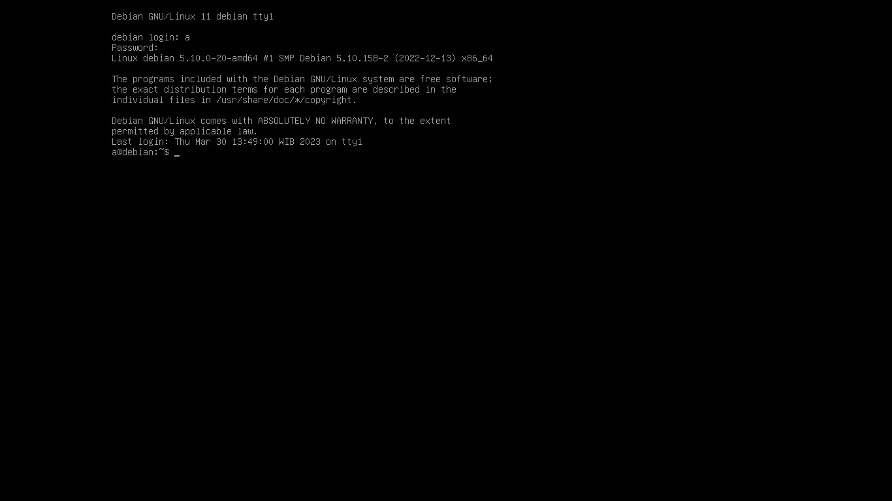

### Daftar Isi

- [Instalasi Debian Server](#instalasi-debian-server)
- [Instalasi NTP Server Debian](#instalasi-ntp-server-debian)
- [Konfigurasi NTP Client Mikrotik ke Server Debian](#konfigurasi-ntp-client-mikrotik-ke-server-debian)
  - [Membuka file konfigurasi ntp server](#membuka-file-konfigurasi-ntp-server)
  - [Menjalankan ntp](#menjalankan-ntp)
  - [ntp client](#ntp-client)
- [Hasil](#hasil)

<br>

# Instalasi Debian Server

Pertama yang harus yang dilakukan adalah instalasi OS yang digunakan pada server, kali ini saya menggunakan Debian server. Untuk tutorial lengkap instalasi, sudah banyak tersebar di google.

[Cara instalasi Debian Server di virtualbox](https://virgiawan.id/tutorial-install-debian-server-di-virtualbox/)

[Cara instal Debian Server](https://idelinux.com/tutorial-install-debian-11-minimal-server-di-virtualbox)

setelah instalasi, pastikan bahwa OS bisa dijalankan.



# Instalasi NTP Server Debian

Selanjutnya adalah instalasi ntp servernya, masukkan perintah dibawah untuk melakukan instalasi

```console
sudo apt install ntp
```

Kemudian tunggu proses instalasi sampai berhasil, dan ntp berhasil ter-_install_ di perangkat.


# Konfigurasi NTP Client Mikrotik ke Server Debian

## Membuka file konfigurasi ntp server

Untuk membuka file konfigurasi ntp, gunakan perintah

```console
sudo vim /etc/ntp.conf
```

kemudian masukkan konfigurasi berikut kedalam file nya

```console
pool 0.debian.pool.ntp.org iburst
pool 1.debian.pool.ntp.org iburst
pool 2.debian.pool.ntp.org iburst
pool 3.debian.pool.ntp.org iburst
```

kemudian simpan konfigurasi.

## Menjalankan ntp

Selanjutnya pastikan bahwa ntp sudah dijalankan menggunakan perintah `sudo service ntp status`. Jika ntp sudah berjalan maka akan tampil seerti berikut


atau kita bisa mengecek tanggal pada terminal kita menggunakan perintah `date`.


## ntp client

selanjutnya kita akan mengkonfigurasi ntp client pada mikrotik kita bisa mengaturnya seperti berikut pada bagian `System -> SNTP Client`, kemudian simpan.


# Hasil

Setelah semua konfigurasi dilakukan, kita bisa mengecek waktu pada mikrotik, jika berhasil maka waktu di mikrotik dan server akan sama.


[def]: #daftar-isi
