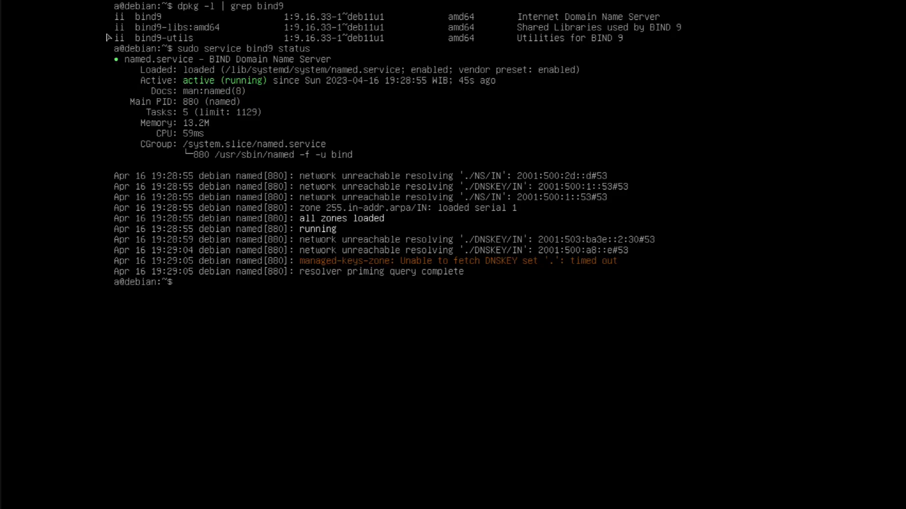
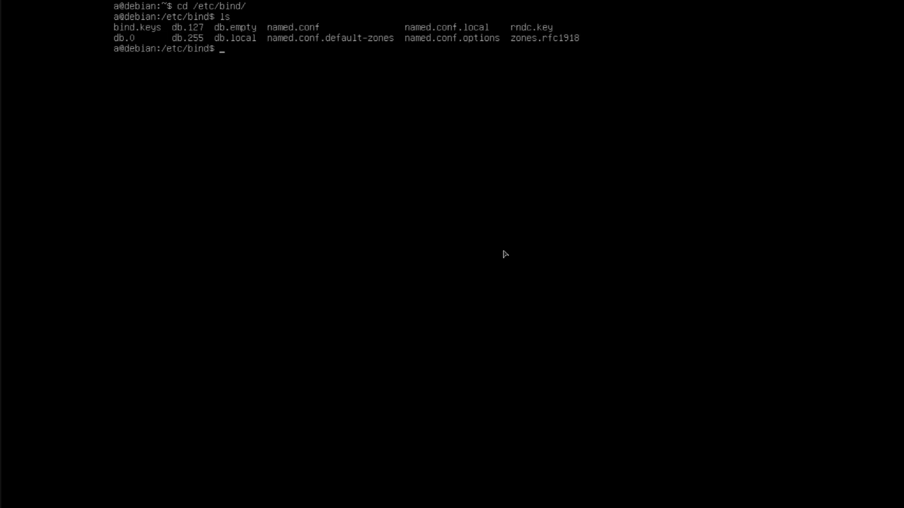
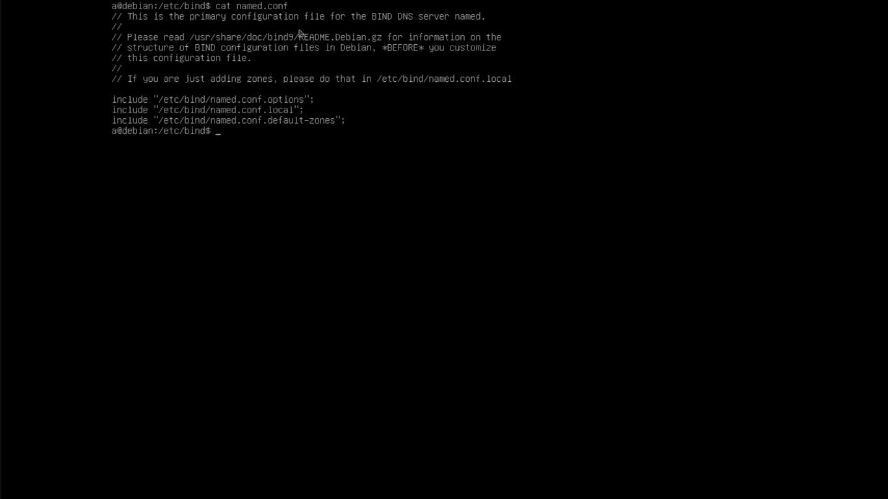
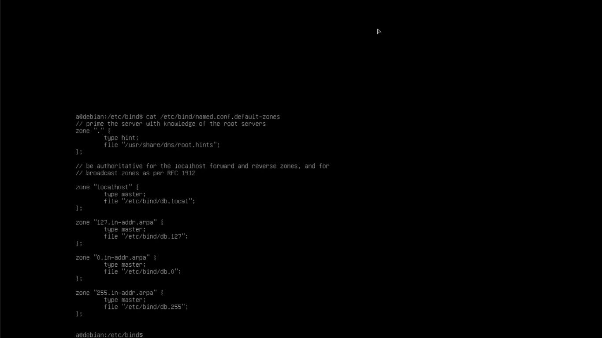
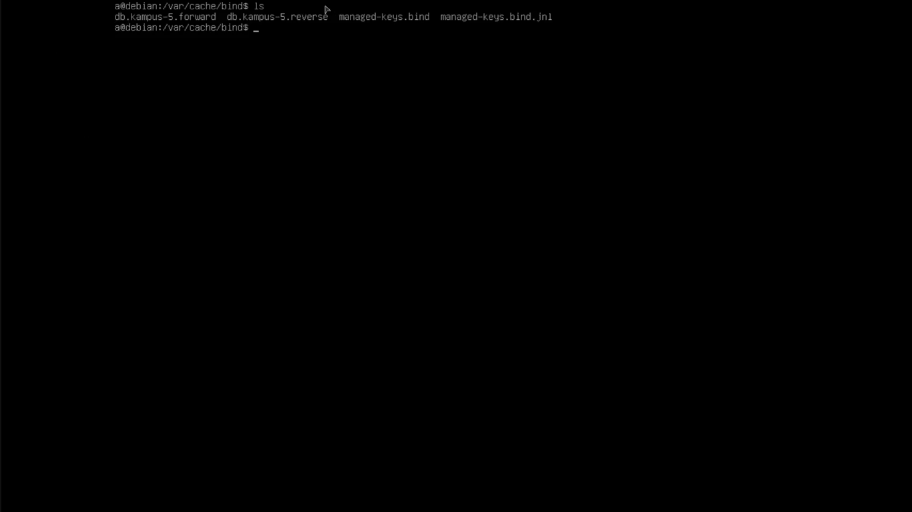
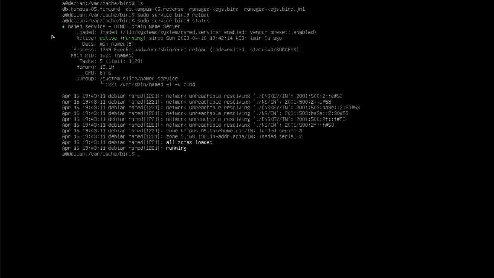
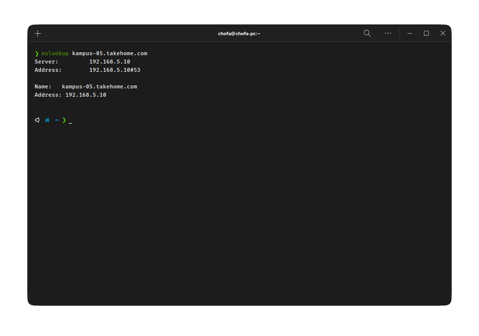

### Daftar Isi

- [Membuat DNS Server](#membuat-dns-server)
- [Mengubah Interface Jaringan](#mengubah-interface-jaringan)
- [Bind9](#bind9)
  - [Instalasi DNS Tools (Bind9)](#instalasi-dns-tools-bind9)
  - [Konfigurasi Bind9](#konfigurasi-bind9)
  - [`named.conf.default_zones`](#namedconfdefault_zones)
  - [Konfigurasi `named.conf.local`](#konfigurasi-namedconflocal)
  - [Konfigurasi `db.kampus-05.forward`](#konfigurasi-dbkampus-05forward)
  - [Konfigurasi `db.kampus-05.reverse`](#konfigurasi-dbkampus-05reverse)
- [Testing](#testing)

<br>

# Membuat DNS Server

---

# Mengubah Interface Jaringan

Pertama yang harus dilakukan adalah mengubah interface yang terkonkeksi ke jaringan. Kita bisa menggunakan perintah dibawah untuk membuka dan mengubah konfigurasi interface

```console
sudo vim /etc/network/interfaces
```

kemudian tambahkan konfigurasi dibawah

```console
auto enp1s0
iface enp1s0 inet static
      address 192.168.5.10/24
      gateway 192.168.5.1
```

kemudian simpan dan reload service `networking` dengan perintah `sudo service networking reload` agar konfigurasi terbaru bisa digunakan

# Bind9

## Instalasi DNS Tools (Bind9)

Sebelum memulai instalasi, cek di device kalian apakah sudah terisntall package Bind9 ini dengan perintah `dpkg -l | grep bind9`. Jika sudah terinstall, bisa lanjut ke langkah selanjutnya dan jika belum, kalian bisa menginstallnya menggunakan perintah dibawah

```console
sudo apt install bind9
```

Kemudian cek lagi apakah sudah terinstall menggunakan perintah sebelumnya dan cek apakah service nya sudah berjalan menggunakan perintah dibawah

```console
sudo service bind9 status
```



Bisa dilihat dari gambar diatas bahwa package berhasil diinstall dan berjalan dengan baik, namun masih belum ada zone yang diatur.

## Konfigurasi Bind9

Untuk melakukan konfigurasi, pergi ke direktori `/etc/bind/` dengan perintah `cd /etc/bind`.



Bisa dilihat jika didalam folder bind ada beberapa file konfigurasi, namun kali ini kita fokus ke folder `named.conf`. Isi dari `named.conf` sendiri adalah konfigurasi utama dari bind server dan petunjuk atau dokumentasinya. Pada file ini juga disertakan petunjuk jika ingin menambah konfigurasi, tambahkan pada file `named.conf.local`.



Disitu juga ada beberapa keyword `include` yang memuat beberapa konfigurasi tambahan untuk bind9 sendiri agar tidak tercampur dengan konfigurasi utamanya.

- `named.conf.options` : berisi pengaturan dasar
- `named.conf.local` : berisi konfigurasi dns untuk lokal
- `named.conf.default-zones` : berisi default zone dari DNS

## `named.conf.default_zones`



Pada file ini terdapat beberapa zone bawaan, yang paling utama adalah localhost dan reverse ke localhost itu sendiri.

Parameter utama dari konfigurasi zone nya sendiri adalah

- nama zone
- tipe dari zone
- dan file yang berhubungan langsung dengan zone nya

Untuk forward kita menggunakan `db.local` dan untuk reverse kita menggunakan gateway `127`

## Konfigurasi `named.conf.local`

Buka file config menggunakan perintah `sudo vim named.conf.local`. Untuk penulisannya kita bisa mengacu pada file `named.conf.default-zones` dan tambahkan konfigurasi dibawah kedalam file `named.conf.local`

```console
zone "kampus-05.takehome.com" {
  type master;
  file "db.kampus-05.forward";
  allow-transfer {10.252.108.212;};
};

zone "5.168.192.in-addr.arpa" {
  type master;
  file "db.kampus-05.reverse";
  allow-transfer {10.252.108.212;};
};
```

File `db.kampus-05.forward` kita gunakan untuk menempatkan record dari zone `kampus-05.takehome.com`.

Kemudian kita akan membuat file `db.kampus-05.forward` dan `db.kampus-05.reverse` pada folder `/var/cache/bind/` karena secara default, cache dari bind disimpan pada folder ini. Atau kita bisa meng-copy file `db.local` dan `db.127` kedalam folder tersebut menggunakan perintah

```console
sudo cp /etc/bind/db.local /var/cache/bind/db.kampus-05.forward
sudo cp /etc/bind/db.127 /var/cache/bind/db.kampus-05.reverse
```

Lalu kita bisa mengecek apakah sudah ada file nya pada direktori tersebut atau belum dengan perintah

```console
sudo cd /var/cache/bind/
ls
```



## Konfigurasi `db.kampus-05.forward`

Buka file tersebut menggunakan perintah `sudo vim db.kampus-5.forward` dan ubah kode

```console
@   IN  SOA localhost.  root.localhost. (
          2           ; Serial
          604800      ; Refresh
          86400       ; Retry
          2419200     ; Expire
          604800      ; Negative Cache TTL
)
@   IN  NS  localhost.
@   IN  A   127.0.0.1
@   IN  AAA ::1
```

Menjadi

```console
@   IN  SOA kampus-05.takehome.com.  ns.kampus-05.takehome.com. (
          3           ; Serial
          604800      ; Refresh
          86400       ; Retry
          2419200     ; Expire
          604800      ; Negative Cache TTL
)
@   IN  NS  kampus-05.takehome.com.
@   IN  A   192.168.5.10
```

**Pengertian masing masing sintaks**

- `@` : Menunjukkan bahwa ini adalah zone root.
- `IN` : Menunjukkan class dari record, dalam hal ini adalah Internet (IN).
- `SOA` : Menunjukkan jenis record, dalam hal ini adalah Start of Authority (SOA).
- `localhost.` : Nama server yang bertanggung jawab untuk zona tersebut.
- `root.localhost.` : Alamat email admin untuk zona tersebut.
- `1` : Nomor serial untuk zona tersebut. Berguna untuk menandai adanya perubahan dalam konfigurasi zona.
- `604800` : Waktu dalam detik di mana server slave akan memperbarui salinan lokal dari zona dari server master.
- `86400` : Waktu dalam detik di mana server slave akan menunggu sebelum mencoba mengambil kembali zona dari server master jika proses syncronisasi gagal.
- `2419200` : Waktu dalam detik di mana server slave akan tetap menggunakan salinan lokal dari zona jika server master tidak merespon atau tidak dapat dijangkau.
- `604800` : Waktu dalam detik di mana server akan menyimpan cache negative untuk record yang tidak ditemukan di zona tersebut.

## Konfigurasi `db.kampus-05.reverse`

Buka file konfigurasi, dan ubah kode dibawah

```console
@     IN  SOA localhost.  root.localhost. (
          1           ; Serial
          604800      ; Refresh
          86400       ; Retry
          2419200     ; Expire
          604800      ; Negative Cache TTL
)
@     IN  NS  localhost.
1.0.0 IN  PTR localhost.
```

menjadi

```console
@   IN  SOA kampus-05.takehome.com.  ns.kampus-05.takehome.com. (
          2           ; Serial
          604800      ; Refresh
          86400       ; Retry
          2419200     ; Expire
          604800      ; Negative Cache TTL
)
@   IN  NS  kampus-05.takehome.com.
10  IN  PTR kampus-05.takehome.com.
```

Setelah selesai mengatur kedua file diatas, selanjutnya kita akan reload service bind agar service menerapkan konfigurasi terbaru menggunakan perintah `sudo service bind9 reload` dan periksa service dari bind menggunakan perintah `sudo service bind9 status`



# Testing

Setelah proses konfigurasi selesai dan memastikan jika service berjalan dengan lancar, maka langkah selanjutnya adalah melakukan testing.

Testing dilakukan dengan menggunakan perintah nslookup pada client dan mengarahkan perintah tersebut pada dns yang sudah kita buat.


[def]: #daftar-isi
