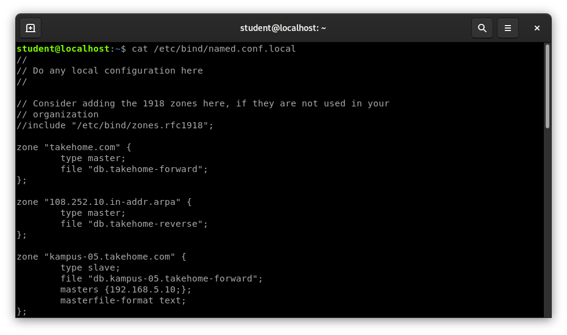
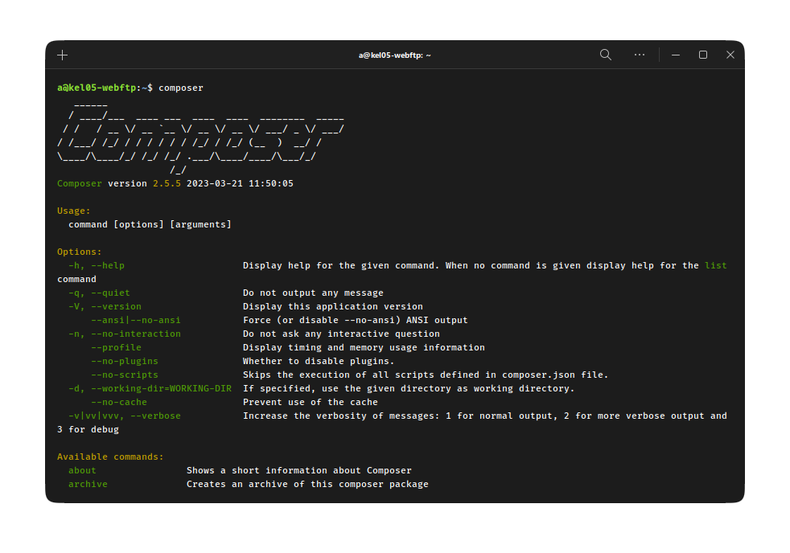
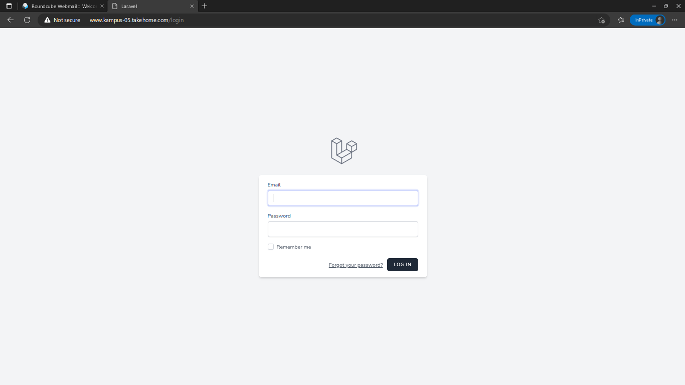

### Daftar Isi

- [Membuat Web Server](#membuat-web-server)
- [Delegasi domain](#delegasi-domain)
  - [Konfigurasi DNS Master Slave](#konfigurasi-dns-master-slave)
  - [Konfigurasi DNS Slave](#konfigurasi-dns-slave)
  - [Verifikasi](#verifikasi)
- [Instalasi web server, php, dan database](#instalasi-web-server-php-dan-database)
  - [Webserver](#webserver)
  - [mariadb-server](#mariadb-server)
    - [Membuat User Baru dan Memberikan Hak Akses](#membuat-user-baru-dan-memberikan-hak-akses)
  - [Membuat project baru dan upload project ke webserver](#membuat-project-baru-dan-upload-project-ke-webserver)
    - [Instalasi dependency yang diperlukan](#instalasi-dependency-yang-diperlukan)
    - [Download dan install Composer](#download-dan-install-composer)
    - [Verifikasi installer](#verifikasi-installer)
    - [Install composer](#install-composer)
    - [Membuat project Laravel](#membuat-project-laravel)
    - [Instalasi Laravel breeze](#instalasi-laravel-breeze)
    - [Memindah project ke `/var/www` dan setup apache](#memindah-project-ke-varwww-dan-setup-apache)
    - [.htaccess](#htaccess)
- [Instalasi konfigurasi FTP Server](#instalasi-konfigurasi-ftp-server)
  - [Melakukan Install ProFTPD pada Server](#melakukan-install-proftpd-pada-server)
  - [Melakukan Backup](#melakukan-backup)
  - [Melakukan edit pada file `proftpd.conf`](#melakukan-edit-pada-file-proftpdconf)
  - [Membuat user](#membuat-user)
  - [Ujicoba Access FTP](#ujicoba-access-ftp)

<br>

# Membuat Web Server

# Delegasi domain

## Konfigurasi DNS Master Slave

Tahap pertama adalah melakukan instalasi dan konfigurasi pada server dns master.

Apabila server dns sudah dikonfigurasi maka selanjutnya kita edit file `named.conf.local` dengan command berikut.

```console
cat /etc/bind/named.conf.local
```

Edit named.conf.local seperti dibawah ini.



Selanjutnya adalah mengedit konfigurasi file forward.

```console
cat /var/cache/bind/db.kampus-05.takehome.forward
```

Ubah seperti dibawah ini.


Pada file konfigurasi di atas, kita menambahkan subdomain ns2 untuk server dns slave. Subdomain tersebut dipetakan ke ip address 10.252.108.10

Kemudian edit juga pada file reverse-nya dengan command berikut.

```console
cat /var/cache/bind/db.kampus-05.takehome.reverse
```

Simpan file konfigurasi, lalu restart service dns.

```console
systemctl restart bind9
```

atau

```console
service bind9 restart
```

Terkahir, edit file /etc/resolv.conf lalu tambahkan ip address server dns slave.

```console
nano /etc.resolv.conf
```

tambahkan ip address server dns slave

```console
nameserver 10.252.108.10
```

## Konfigurasi DNS Slave

Konfigurasi yang dilakukan pada dns slave adalah mendefinisikan zona seperti pada server dns master. Akan tetapi sebelum melakukan konfigurasi, instal dahulu service dns servernya.

```console
apt install bind9
```

Selanjutnya edit file named.conf.local.

```console
nano /etc/bind/named.conf.local
```

Tambahkan konfigurasi berikut :

```console
zone "kampus-05.takehome.com" {
    type slave;
    file "kampus-05.takehome.com.forward";
    masters {10.252.108.10;};
};
```

Konfigurasi di atas adalah mendefinisikan zona `kampus-05.takehome.com`. Karena ini adalah DNS slave, maka type yang digunakan adalah slave. Kemudian kita tambahkan DNS masternya pada bagian,
masters {10.252.108.10;};

Pada konfigurasi di atas, kita hanya mendefinisikan forward zone, sedangkan reverse zone-nya tidak ada. Hal ini dikarenakan DNS slave tidak melakukan backup atau caching terhadap file reverse. Sehingga nanti hanya akan ada file forward saja yang akan diterima dari DNS master.

Kita juga tidak mendefinisikan direktori tempat menyimpan file forward-nya. Secara default, direktori yang akan digunakan untuk menyimpan file tersebut adalah `/var/cache/bind`.

Langkah berikutnya adalah mengedit file `/etc/resolv.conf`lalu menambahkan ip DNS master dan DNS slave.

```console
nameserver 10.252.108.10
nameserver 192.168.5.80
```

Kemudian merestart service dns.

```console
systemctl restart bind9
```

atau

```console
service bind9 restart
```

## Verifikasi

Cek pada direktori `/var/cache/bind` apakah sudah ada file forward dari DNS master dengan command berikut.

```console
ls /var/cache/bind/
```

Maka akan muncul seperti ini

```console
db.10 kampus-05.takehome.com.forward managed-keys.bind
```

Selanjutnya kita coba melakukan nslookup dari dns slave dengan command berikut.

```console
nslookup ns2.kampus-05.takehome.com
```

jika hasilnya muncul maka selesai sudah konfigurasi DNS Master Slave kita.

# Instalasi web server, php, dan database

## Webserver

Masukkan perintah dibawah untuk menginstall webserver (apache2), php dan database(mariadb-server)

```console
sudo apt install apache2 php php-mysql phpmyadmin mysql-server
```

kemudian `enter` dan tunggu proses instalasi. Setelah itu akan muncul tampilan untuk mengatur webserver yang akan digunakan untuk phpmyadmin


pilih `apache2` dengan tekan spasi, kemudian enter. Kemudian akan diarahkan lagi untuk mengatur


pilih yes dan enter dan tunggu sampai selesai.

Untuk mengecek apakah webserver sudah terinstall, masukkan perintah `sudo systemctl status apache2`


## mariadb-server

Pada langkah sebelumnya mariadb sudah berhasil terinstall, namun belum ada konfigurasi. Masukkan perintah dibawah untuk mengkonfigurasi

```console
sudo mysql_secure_installation
```

Setelah di enter, maka akan dihadapkan beberapa pilihan konfigurasi seperti password dan lain-lain. Kemudian tunggu sampai proses selesai


### Membuat User Baru dan Memberikan Hak Akses

Pertama masuk ke root user dengan perintah

```console
sudo mysql
```

kemudian masukkan perintah dibawah untuk membuat user baru

```console
CREATE USER 'username'@'hostname' IDENTIFIED BY 'password';
```

dan perintah dibawah untuk memberi hak akses kepada user

```console
GRANT ALL PRIVILEGES ON * . * TO 'username'@'hostname';
```


## Membuat project baru dan upload project ke webserver

Pertama yang harus dilakukan adalah instalasi Composer sebagai package manager di PHP. Masukkan perintah dibawah untuk melakukan instalasi Composer

### Instalasi dependency yang diperlukan

```console
sudo apt update
sudo apt install php-cli unzip
```

### Download dan install Composer

```console
cd ~
curl -sS https://getcomposer.org/installer -o /tmp/composer-setup.php
```

### Verifikasi installer

```console
HASH=`curl -sS https://composer.github.io/installer.sig`
echo $HASH
```

Output

```markdown
Output
e0012edf3e80b6978849f5eff0d4b4e4c79ff1609dd1e613307e16318854d24ae64f26d17af3ef0bf7cfb710ca74755a
```

Verifikasi

```console
php -r "if (hash_file('SHA384', '/tmp/composer-setup.php') === '$HASH') { echo 'Installer verified'; } else { echo 'Installer corrupt'; unlink('composer-setup.php'); } echo PHP_EOL;"
```

Output

```markdown
Installer verified
```

> Jika output verified, maka bisa dilanjutkan ke tahap berikutnya

### Install composer

```console
sudo php /tmp/composer-setup.php --install-dir=/usr/local/bin --filename=composer
```

tunggu proses instalasi sampai selesai dan menampilkan pesan seperti dibawah

```markdown
Output
All settings correct for using Composer
Downloading...

Composer (version 2.2.9) successfully installed to: /usr/local/bin/composer
Use it: php /usr/local/bin/composer
```

kemudian tes menggunakan perintah `composer` pada terminal



### Membuat project Laravel

Buat direktori baru pada `/home` dengan nama `project`. Kemudian masukkan perintah dibawah untuk melakukan instalasi Laravel

```console
composer create-project laravel/laravel [project-name]
```

tunggu proses selesai dan masuk ke folder project dengan perintah `cd project-name`. Lalu buka file `.env` untuk mengatur database yang digunakan pada bagian dibawah (pastikan jika database sudah dibuat pada proses sebelumnya)

```console
DB_CONNECTION=mysql
DB_HOST=127.0.0.1
DB_PORT=3306
DB_DATABASE=<nama_database>
DB_USERNAME=<username>
DB_PASSWORD=<password, kosongi jika tidak menggunakan password>
```

### Instalasi Laravel breeze

Untuk mempermudah penugasan, disini saya menggunakan Laravel Breeze, masukkan perintah dibawah untuk melakukan instalasi dan setup

```console
composer require laravel/breeze --dev
php artisan breeze:install

php artisan migrate
npm install
npm run dev
```

Setelah menginstall breeze, kita bisa melakukan registrasi dan login untuk memanfaatkan database yang sebelumnya dibuat



### Memindah project ke `/var/www` dan setup apache

Disini saya mencoba untuk mengupload project laravel yang sebelumnya dibuat. Agar web bisa diakses secara global, letakkan project pada folder `/var/www` dengan perintah `sudo mv /nama-project /var/www`. Kemudian ubah konfigurasi virtual host pada `000-default.conf` pada folder `/etc/apache2/sites-available/` menggunakan perintah dibawah

```console
sudo vim /etc/apache2/sites-available/000-default.conf
```

ubah bagian dibawah

```console
# from
DocumentRoot /var/www/html/

# to
DocumentRoot /var/www/project/public
```

### .htaccess

Jika diperlukan konfigurasi .htaccess, buka file `apache2.conf` dengan perintah di bawah

```console
sudo vim /etc/apache2/apache2.conf
```

Cari baris kode `AccessFileName .htaccess`. Jika di depannya ada tanda pagar (#) silakan dihapus.

Kemudian temukan baris kode dengan script di bawah ini.

```console
<Directory /var/www/>
     Options Indexes FollowSymLinks
     AllowOverride None
     Require all granted
</Directory>
```

Kemudian ganti kata “None” menjadi “All”

`AllowOverride All`

Selanjutnya aktifkan ModRewrite dengan mengetikkan perintah.

```console
sudo a2enmod rewrite
```

Terakhir restart apache server

```console
sudo service apache2 restart
```

# Instalasi konfigurasi FTP Server

Update dan upgrade repository dengan perintah `sudo apt update && sudo apt upgrade`, tunggu sampai proses selesai

## Melakukan Install ProFTPD pada Server

Lakukan instalasi dengan memasukkan perintah

```console
sudo apt-get install proftpd
```


Pada saat install proFTPD akan ada pertanyaan

```console
Do you want to continue?[Y/n]
```

Anda hanya perlu menekan "Y" dan enter, Maka proses install akan berjalan. perlu diingat computer harus connect pada internet.

## Melakukan Backup

Sebelum mengedit file anda perlu melakukan backup paa file `proftpd.conf` dengan mengetikan perintah berikut.

```console
sudo cp /etc/proftpd/proftpd.conf /etc/proftpd/proftpd.conf.backup
```

## Melakukan edit pada file `proftpd.conf`

Untuk mengedit file `proftpd.conf` dengan mengetikan perintah berikut.

```console
sudo nano /etc/proftpd/proftpd.conf
```

setelah itu akan terbuka file `proftpd.conf`. anda hanya perlu menganti beberapa baris untuk settingan default.


Ubah UseIPv6 yang awalnya on menjadi off.


Kemudian Ubah Domain sesuai dengan nama Domain Anda. Disini Nama Domain saya adalah `kampus-05.takehome.com`.


Setelah itu uncommand `DefaultRoot` di bagian bawah file.

Setelah itu anda dapat menekan `"Ctrl+X"` untuk keluar dan tekan `"Y"` untuk konfirmasi dan kemudian tekan `"Enter"`.

## Membuat user

Masukkan perintah `sudo adduser [namauser]` untuk membuat user, kemudian tekan `y`

Anda dapat mengubah `namauser` dengan nama yang ingin anda berikan pada user. kemudian isi data yang muncul di layar. untuk yang wajib di isi adalah.

```console
New password :
Retype new password :
```

Kemudian tekan `Y` untuk konfirmasi.

## Ujicoba Access FTP

Anda bisa menggunakan file exploler pada windows atau dengan file exploler lainnya.

jika anda menggunakan file exploler pada windows, anda dapat mengetikan alamat ip servic seperti berikut


Kemudian tekan `Enter` dan anda akan di arahkan untuk melakukan login dengan memasukkan username dan password.


Setelah itu masukan Username and Password anda lalu tekan Log On. dan selamat anda sudah dapat melakukan Upload file pada server.

[def]: #daftar-isi
