### Daftar Isi

- [Membuat Web Server](#membuat-web-server)
  - [Delegasi domain](#delegasi-domain)
    - [Zone 1 (takehome.com (primary))](#zone-1-takehomecom-primary)
    - [Zone 2 (kampus-05.takehome.com (secondary))](#zone-2-kampus-05takehomecom-secondary)
    - [Zone anu](#zone-anu)
  - [Instalasi web server, php, dan database](#instalasi-web-server-php-dan-database)
    - [mariadb-server](#mariadb-server)
      - [Membuat User Baru dan Memberikan Hak Akses](#membuat-user-baru-dan-memberikan-hak-akses)
      - [Upload Project ke webserver](#upload-project-ke-webserver)
      - [.htaccess](#htaccess)
  - [Instalasi konfigurasi FTP Server](#instalasi-konfigurasi-ftp-server)
    - [Melakukan Install ProFTPD pada Server](#melakukan-install-proftpd-pada-server)
    - [Melakukan Backup](#melakukan-backup)
    - [Melakukan edit pada file `proftpd.conf`](#melakukan-edit-pada-file-proftpdconf)
    - [Membuat user](#membuat-user)
    - [Ujicoba Access FTP](#ujicoba-access-ftp)

<br>

# Membuat Web Server

## Delegasi domain

### Zone 1 (takehome.com (primary))

### Zone 2 (kampus-05.takehome.com (secondary))

### Zone anu

## Instalasi web server, php, dan database

Masukkan perintah dibawah untuk menginstall webserver (apache2), php dan database(mariadb-server)

```console
sudo apt install apache2 php php-mysql phpmyadmin mysql-server
```

kemudian `enter` dan tunggu proses instalasi. Setelah itu akan muncul tampilan untuk mengatur webserver yang akan digunakan untuk phpmyadmin

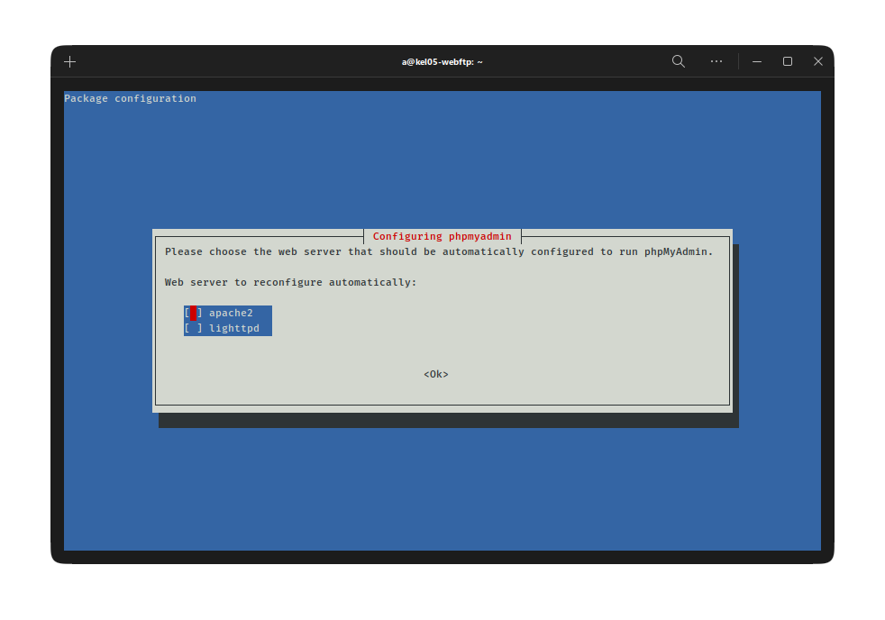

pilih `apache2` dengan tekan spasi, kemudian enter. Kemudian akan diarahkan lagi untuk mengatur

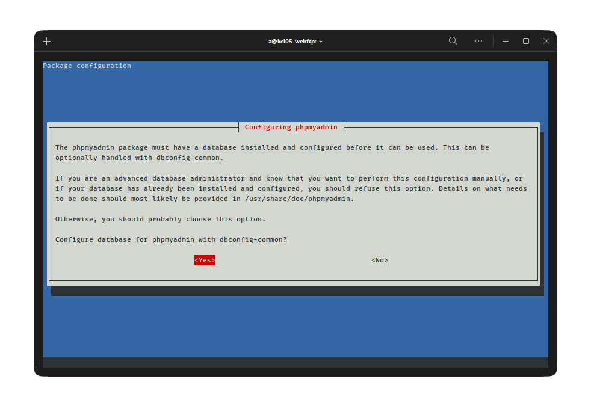

pilih yes dan enter dan tunggu sampai selesai.

Untuk mengecek apakah webserver sudah terinstall, masukkan perintah `sudo systemctl status apache2`

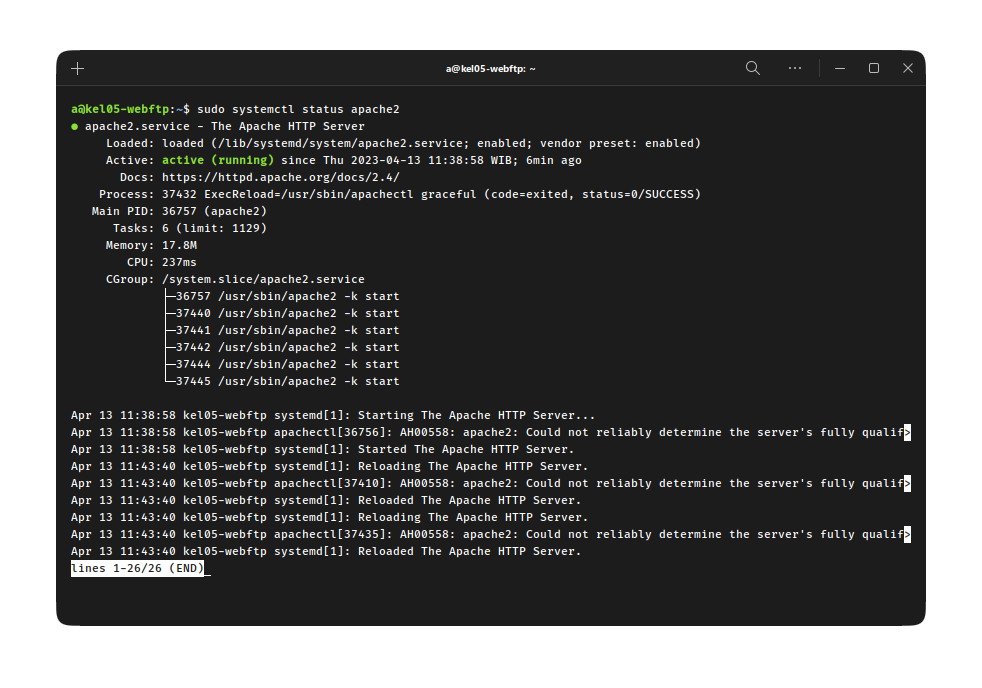

### mariadb-server

Pada langkah sebelumnya mariadb sudah berhasil terinstall, namun belum ada konfigurasi. Masukkan perintah dibawah untuk mengkonfigurasi

```console
sudo mysql_secure_installation
```

Setelah di enter, maka akan dihadapkan beberapa pilihan konfigurasi seperti password dan lain-lain. Kemudian tunggu sampai proses selesai

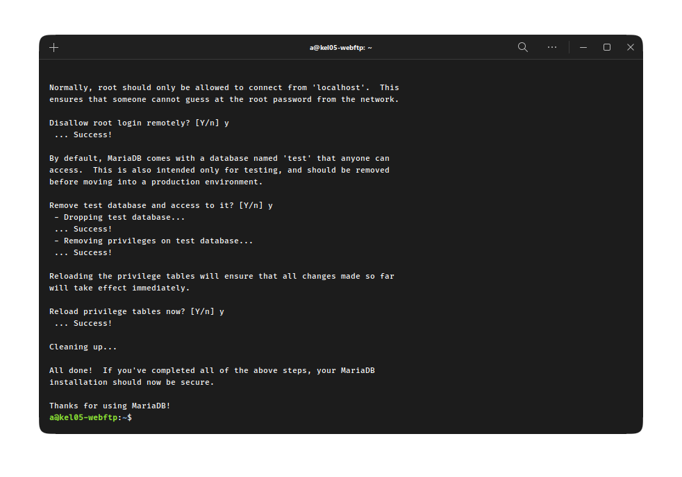

#### Membuat User Baru dan Memberikan Hak Akses

Pertama masuk ke root user dengan perintah

```console
sudo mysql
```

kemudian masukkan perintah dibawah untuk membuat user baru

```console
CREATE USER 'username'@'hostname' IDENTIFIED BY 'password';
```

dan perintah dibawah untuk memberi hak akses kepada user

```console
GRANT ALL PRIVILEGES ON * . * TO 'username'@'hostname';
```

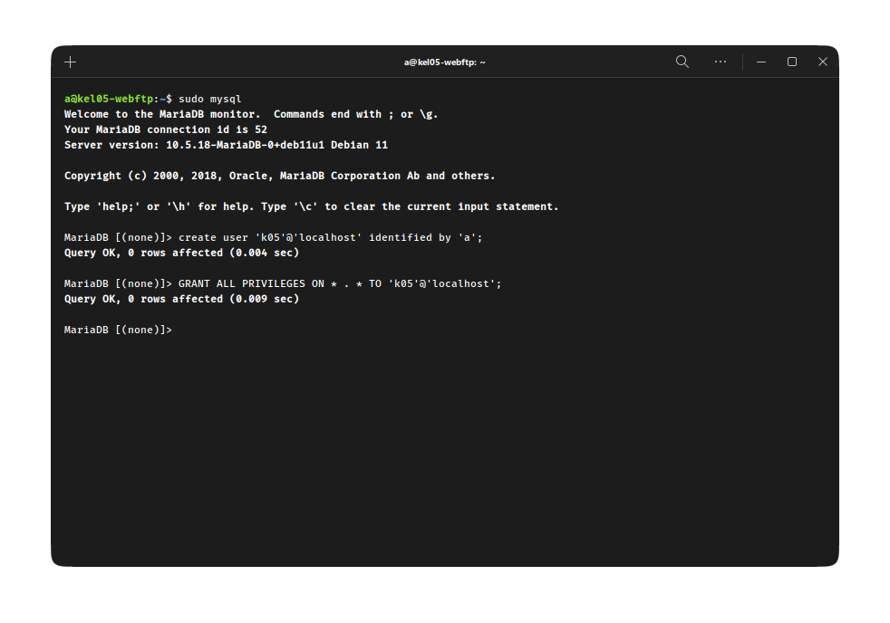

#### Upload Project ke webserver

Disini saya mencoba untuk mengupload project laravel kosong yang hanya berisi autentikasi dan dashboard saja. Agar web bisa diakses secara global, letakkan project pada folder `/var/www`.

#### .htaccess

Jika diperlukan konfigurasi .htaccess, buka file `apache2.conf` dengan perintah di bawah

```console
sudo vim /etc/apache2/apache2.conf
```

Cari baris kode `AccessFileName .htaccess`. Jika di depannya ada tanda pagar (#) silakan dihapus.

Kemudian temukan baris kode dengan script di bawah ini.

```console
<Directory /var/www/>
     Options Indexes FollowSymLinks
     AllowOverride None
     Require all granted
</Directory>
```

Kemudian ganti kata “None” menjadi “All”

`AllowOverride All`

Selanjutnya aktifkan ModRewrite dengan mengetikkan perintah.

```console
sudo a2enmod rewrite
```

Terakhir restart apache server

```console
sudo service apache2 restart
```

## Instalasi konfigurasi FTP Server

Update dan upgrade repository dengan perintah `sudo apt update && sudo apt upgrade`, tunggu sampai proses selesai

### Melakukan Install ProFTPD pada Server

Lakukan instalasi dengan memasukkan perintah

```console
sudo apt-get install proftpd
```

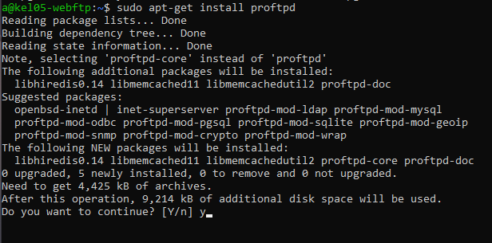

Pada saat install proFTPD akan ada pertanyaan

```console
Do you want to continue?[Y/n]
```

Anda hanya perlu menekan "Y" dan enter, Maka proses install akan berjalan. perlu diingat computer harus connect pada internet.

### Melakukan Backup

Sebelum mengedit file anda perlu melakukan backup paa file `proftpd.conf` dengan mengetikan perintah berikut.

```console
sudo cp /etc/proftpd/proftpd.conf /etc/proftpd/proftpd.conf.backup
```

### Melakukan edit pada file `proftpd.conf`

Untuk mengedit file `proftpd.conf` dengan mengetikan perintah berikut.

```console
sudo nano /etc/proftpd/proftpd.conf
```

setelah itu akan terbuka file `proftpd.conf`. anda hanya perlu menganti beberapa baris untuk settingan default.

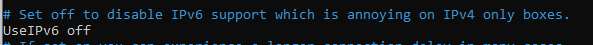

Ubah UseIPv6 yang awalnya on menjadi off.

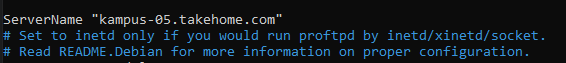

Kemudian Ubah Domain sesuai dengan nama Domain Anda. Disini Nama Domain saya adalah `kampus-05.takehome.com`.

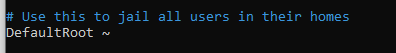

Setelah itu uncommand `DefaultRoot` di bagian bawah file.

Setelah itu anda dapat menekan `"Ctrl+X"` untuk keluar dan tekan `"Y"` untuk konfirmasi dan kemudian tekan `"Enter"`.

### Membuat user

Masukkan perintah `sudo adduser [namauser]` untuk membuat user, kemudian tekan `y`

Anda dapat mengubah `namauser` dengan nama yang ingin anda berikan pada user. kemudian isi data yang muncul di layar. untuk yang wajib di isi adalah.

```console
New password :
Retype new password :
```

Kemudian tekan `Y` untuk konfirmasi.

### Ujicoba Access FTP

Anda bisa menggunakan file exploler pada windows atau dengan file exploler lainnya.

jika anda menggunakan file exploler pada windows, anda dapat mengetikan alamat ip servic seperti berikut

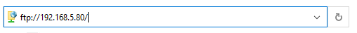

Kemudian tekan `Enter` dan anda akan di arahkan untuk melakukan login dengan memasukkan username dan password.

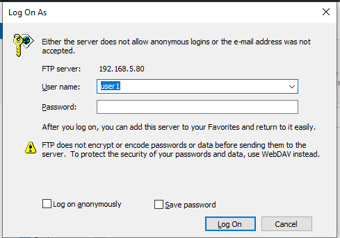

Setelah itu masukan Username and Password anda lalu tekan Log On. dan selamat anda sudah dapat melakukan Upload file pada server.

[def]: #daftar-isi
